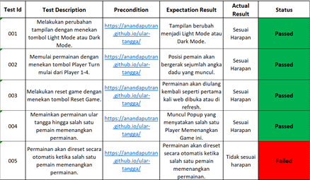
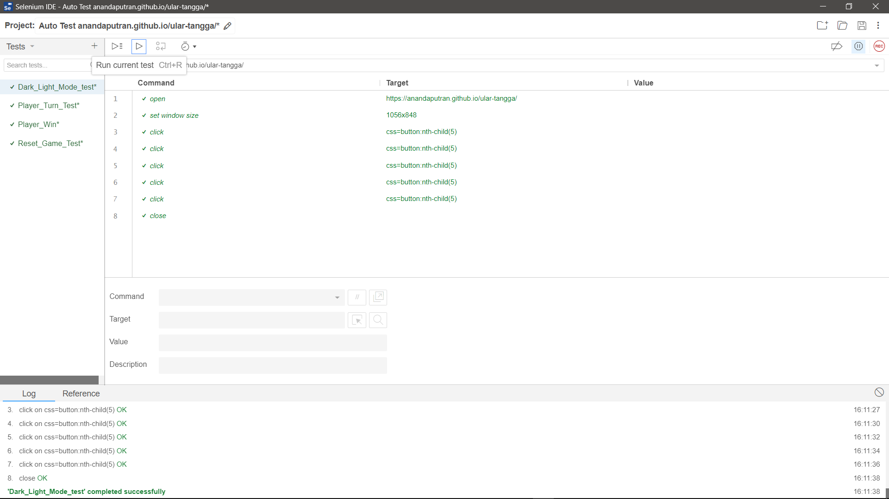
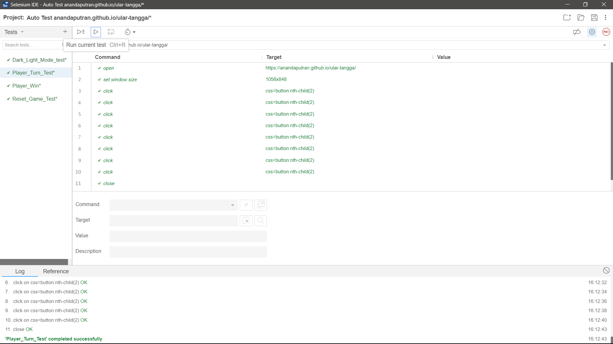
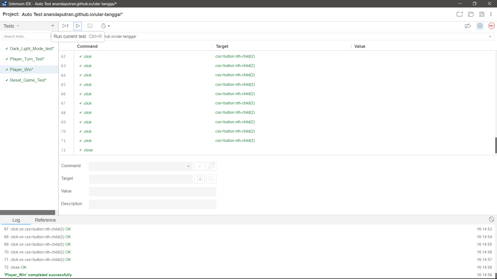
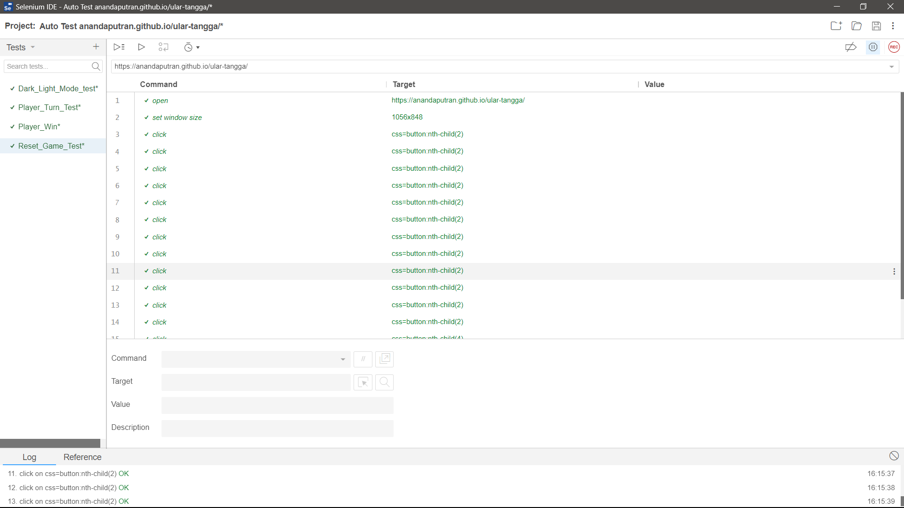
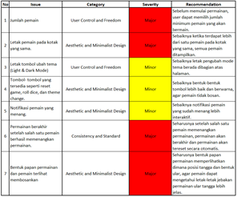

# Pengujian Aplikasi Web

> Studi kasus pengujian yang mencakup pengujian fungsional manual, automation testing menggunakan Selenium IDE, dan usability testing menggunakan Heuristic Evaluation Nielsen pada permainan ular tangga berbasis web.

[English](README.md) | [Bahasa Indonesia](README-ID.md)

## Gambaran Umum

Project ini mendokumentasikan proses pengujian yang dilakukan pada permainan ular tangga berbasis web sebagai bagian dari project akademik.

Pengujian berfokus pada dua aspek kualitas perangkat lunak, yaitu **functional correctness** dan **usability**. Pengujian fungsional manual digunakan untuk memvalidasi fungsi utama game, Selenium IDE digunakan untuk mengotomatisasi beberapa skenario fungsional, dan Heuristic Evaluation Nielsen digunakan untuk mengidentifikasi masalah usability pada antarmuka.

Studi kasus ini menunjukkan bagaimana functional testing dan usability evaluation dapat saling melengkapi. Sebuah aplikasi dapat menjalankan fungsi utamanya sesuai harapan, tetapi masih memiliki masalah usability yang memengaruhi pengalaman pengguna.

### Aplikasi yang Diuji

Aplikasi yang digunakan dalam studi kasus ini adalah permainan ular tangga berbasis web yang dikembangkan sebagai project akademik.

  

### Ruang Lingkup Pengujian

- **Pengujian Fungsional Manual** — 5 test case yang mencakup pergantian mode tampilan, giliran pemain, reset game, kondisi kemenangan, dan perilaku restart game secara tidak langsung.
- **Automation Testing** — 4 skenario fungsional yang diotomatisasi menggunakan Selenium IDE.
- **Usability Testing** — Heuristic Evaluation berdasarkan prinsip usability Nielsen, termasuk severity dan rekomendasi perbaikan.

---

## Pengujian Fungsional Manual

Pengujian fungsional manual dilakukan untuk memastikan apakah fungsi-fungsi utama game berjalan sesuai dengan hasil yang diharapkan.

Setiap test case mendokumentasikan skenario pengujian, precondition, expected result, actual result, dan status akhir. Sebanyak **5 test case** dijalankan, dengan hasil **4 Passed dan 1 Failed**.

| Test ID | Skenario | Hasil |
| --- | --- | --- |
| 001 | Beralih antara Light Mode dan Dark Mode | Passed |
| 002 | Urutan giliran pemain | Passed |
| 003 | Reset game menggunakan tombol Reset Game | Passed |
| 004 | Kondisi kemenangan dan notifikasi akhir permainan | Passed |
| 005 | Restart game secara otomatis setelah salah satu pemain menang | Failed |

Skenario yang gagal terjadi ketika game dimulai ulang secara otomatis setelah salah satu pemain menang. Game tidak melakukan restart sebagaimana yang diharapkan dan menghasilkan perilaku yang tidak sesuai, sehingga alur ini memerlukan penanganan lebih lanjut.

### Bukti Pengujian Manual

Dokumentasi pengujian manual mencakup precondition, expected result, actual result, dan status dari setiap skenario.

  

---

## Automation Testing dengan Selenium IDE

Setelah pengujian fungsional manual, beberapa skenario dipilih untuk diotomatisasi menggunakan **Selenium IDE** guna memverifikasi perilaku aplikasi yang dapat dijalankan secara berulang.

Empat skenario fungsional digunakan dalam automation testing:

| Skenario Pengujian | Tujuan |
| --- | --- |
| Dark / Light Mode | Memverifikasi fungsi pergantian mode tampilan |
| Player Turn | Memverifikasi urutan giliran pemain |
| Player Win | Memverifikasi alur kemenangan dan akhir permainan |
| Reset Game | Memverifikasi fungsi reset game |

Automated test menggunakan interaksi browser yang direkam dan target elemen untuk menjalankan kembali setiap skenario. Test run yang tersedia berhasil diselesaikan menggunakan Selenium IDE.

### Bukti Automation Testing

#### Dark / Light Mode

#### Player Turn

#### Player Win

#### Reset Game

---

## Heuristic Evaluation

Usability testing dilakukan menggunakan **Heuristic Evaluation Nielsen** untuk mengidentifikasi masalah antarmuka dan interaksi yang tidak ditemukan melalui functional testing.

Setiap temuan didokumentasikan berdasarkan prinsip usability yang terkait, diberikan tingkat severity, dan dilengkapi dengan rekomendasi perbaikan.

Sebanyak **7 masalah usability** ditemukan pada beberapa kategori heuristic, termasuk:

- **User Control and Freedom**
- **Aesthetic and Minimalist Design**
- **Consistency and Standards**

Temuan tersebut mencakup masalah yang berkaitan dengan kontrol permainan, layout antarmuka, penempatan tombol, notifikasi pemain, kondisi kemenangan, dan penyajian papan permainan.

### Severity

Masalah yang ditemukan diklasifikasikan menjadi dua tingkat severity:

- **Major** — Masalah yang memiliki dampak signifikan terhadap usability atau interaksi pemain dengan game.
- **Minor** — Masalah dengan dampak lebih rendah, tetapi tetap memerlukan perbaikan agar pengalaman pengguna lebih jelas dan konsisten.

### Bukti Heuristic Evaluation

Hasil evaluasi mendokumentasikan setiap masalah usability beserta kategori heuristic, tingkat severity, dan rekomendasi perbaikannya.

  

---

## Ringkasan Pengujian

Proses pengujian menunjukkan bahwa functional correctness dan usability memberikan perspektif yang berbeda dalam mengevaluasi kualitas perangkat lunak.

| Metode Pengujian | Hasil |
| --- | --- |
| Pengujian Fungsional Manual | 5 test case dijalankan: 4 Passed, 1 Failed |
| Selenium IDE Automation | 4 skenario fungsional diotomatisasi dan berhasil dijalankan |
| Heuristic Evaluation | 7 masalah usability ditemukan pada 3 kategori heuristic |

Pengujian manual dan automation digunakan untuk memverifikasi perilaku fungsi utama game, sedangkan Heuristic Evaluation menemukan masalah usability yang tidak teridentifikasi melalui functional testing saja.

### Poin Utama

- Functional test yang berhasil tidak selalu berarti aplikasi tidak memiliki masalah usability.
- Pengujian manual membantu menemukan perilaku yang tidak sesuai pada skenario restart game secara tidak langsung.
- Selenium IDE memungkinkan skenario fungsional tertentu dijalankan secara berulang.
- Heuristic Evaluation memberikan perspektif berbeda dengan berfokus pada cara pengguna berinteraksi dengan antarmuka.
- Kombinasi functional testing dan usability testing memberikan gambaran yang lebih lengkap mengenai kualitas aplikasi.

---

## Tools & Metode

- **Manual Functional Testing**
- **Selenium IDE**
- **Nielsen's Heuristic Evaluation**
- **Test Case Documentation**
- **Severity Classification**

## Konteks Project

Studi kasus ini dilakukan sebagai bagian dari project akademik pada permainan ular tangga berbasis web.

Dokumentasi pengujian dalam repository ini dibuat berdasarkan proses pengujian asli dan evidence yang masih tersedia dari project tersebut.

---

## Project Terkait

Aplikasi yang digunakan dalam studi kasus ini tersedia pada repository berikut:

[Simple Snake & Ladder Game](https://github.com/anandaputran/ular-tangga)