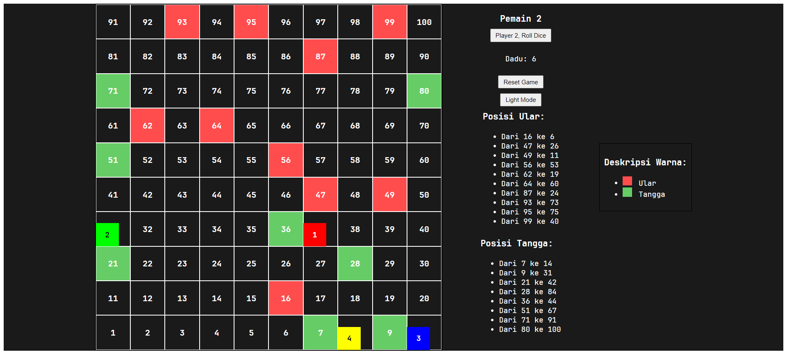

# Web Application Testing

> A case study covering manual functional testing, Selenium IDE automation, and usability testing using Nielsen's Heuristic Evaluation on a web-based Snake and Ladder game.

[English](README.md) | [Bahasa Indonesia](README-ID.md)

## Overview

This project documents the testing process conducted on a web-based Snake and Ladder game as part of an academic project.

The testing focused on two aspects of software quality: **functional correctness** and **usability**. Manual functional testing was used to validate core game behavior, Selenium IDE was used to automate selected functional scenarios, and Nielsen's Heuristic Evaluation was used to identify usability issues in the interface.

The case study demonstrates how functional testing and usability evaluation can complement each other. An application may perform its core functions as expected while still presenting usability issues that affect the user experience.

### Application Under Test

The application used in this case study is a web-based Snake and Ladder game developed as an academic project.

  

### Testing Scope

- **Manual Functional Testing** — 5 test cases covering display mode, player turns, game reset, winning conditions, and indirect game restart behavior.
- **Automation Testing** — 4 functional scenarios automated using Selenium IDE.
- **Usability Testing** — Heuristic Evaluation based on Nielsen's usability principles, including issue severity and improvement recommendations.

---

## Manual Functional Testing

Manual functional testing was performed to verify whether the core features of the game behaved according to the expected results.

Each test case documented the test scenario, precondition, expected result, actual result, and final status. A total of **5 test cases** were executed, with **4 Passed and 1 Failed**.

| Test ID | Scenario | Result |
| --- | --- | --- |
| 001 | Switch between Light Mode and Dark Mode | Passed |
| 002 | Player turn sequence | Passed |
| 003 | Reset the game using the Reset Game button | Passed |
| 004 | Winning condition and end-game notification | Passed |
| 005 | Automatic game reset after a player wins | Failed |

The failed scenario occurred when the game was expected to reset automatically after a player had won. However, the game did not reset as expected, indicating that this flow required further improvement.

### Manual Testing Evidence

The complete manual test documentation includes the preconditions, expected results, actual results, and status for each scenario.

  

---

## Automation Testing with Selenium IDE

After the manual functional testing, selected scenarios were automated using **Selenium IDE** to verify repeatable application behavior.

Four functional scenarios were included in the automation testing:

| Test Scenario | Purpose |
| --- | --- |
| Dark / Light Mode | Verify the display mode switching behavior |
| Player Turn | Verify the player turn sequence |
| Player Win | Verify the winning flow and end-game behavior |
| Reset Game | Verify the game reset functionality |

The automated tests used recorded browser interactions and element targets to reproduce each scenario. The available test runs completed successfully in Selenium IDE.

### Automation Testing Evidence

#### Dark / Light Mode

#### Player Turn

#### Player Win

#### Reset Game

---

## Heuristic Evaluation

Usability testing was performed using **Nielsen's Heuristic Evaluation** to identify interface and interaction issues that were not captured through functional testing.

Each finding was documented based on the affected usability principle, assigned a severity level, and accompanied by a recommendation for improvement.

A total of **7 usability issues** were identified across several heuristic categories, including:

- **User Control and Freedom**
- **Aesthetic and Minimalist Design**
- **Consistency and Standards**

The findings included issues related to game controls, interface layout, button placement, player notifications, winning conditions, and the presentation of the game board.

### Severity

The identified issues were classified into two severity levels:

- **Major** — Issues with a significant impact on usability or the player's interaction with the game.
- **Minor** — Issues with a lower impact but still requiring improvement to provide a clearer and more consistent user experience.

### Heuristic Evaluation Evidence

The evaluation documented each usability issue along with its heuristic category, severity level, and recommended improvement.

  

---

## Testing Summary

The testing process showed that functional correctness and usability provide different perspectives when evaluating software quality.

| Testing Method | Result |
| --- | --- |
| Manual Functional Testing | 5 test cases executed: 4 Passed, 1 Failed |
| Selenium IDE Automation | 4 functional scenarios automated and completed successfully |
| Heuristic Evaluation | 7 usability issues identified across 3 heuristic categories |

The manual and automation testing verified the behavior of the game's core functionality, while the heuristic evaluation revealed usability issues that functional testing alone did not identify.

### Key Takeaways

- Passing functional tests does not necessarily mean an application has no usability issues.
- Manual testing helped identify an unexpected behavior in an indirect game restart scenario.
- Selenium IDE provided repeatable execution for selected functional scenarios.
- Heuristic Evaluation provided a different perspective by focusing on how users interact with the interface.
- Combining functional and usability testing provided a more complete view of the application's quality.

---

## Tools & Methods

- **Manual Functional Testing**
- **Selenium IDE**
- **Nielsen's Heuristic Evaluation**
- **Test Case Documentation**
- **Severity Classification**

## Project Context

This case study was conducted as part of an academic project on a web-based Snake and Ladder game.

The testing documentation presented in this repository is based on the original testing process and available evidence from the project.

---

## Related Project

The application used in this case study is available in the following repository:

[Simple Snake & Ladder Game](https://github.com/anandaputran/ular-tangga)